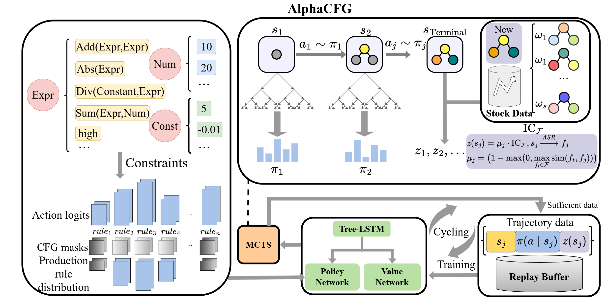
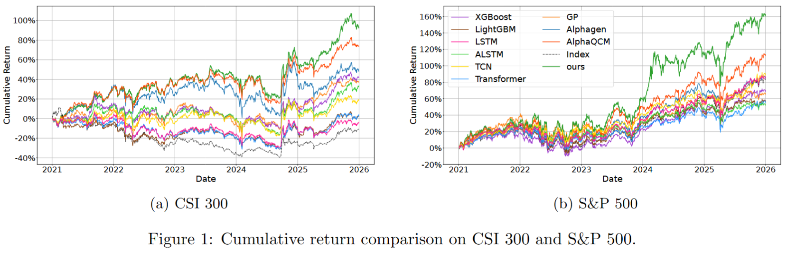

# Implementation of "Alpha Discovery via Grammar-Guided Learning and Search"

## Project Structure

```
.
├── CFG-Syn/             # Syntax-validity processing engine
├── CFG-Sem/             # + Semantic-validity processing engine
├── CFG-Sem-k/           # + Constraint-optimized processing engine
├── RPN/                 # Reverse Polish Notation calculator
├── ML/                  # Baseline methods that directly use machine learning techniques to predict stock returns
├── requirements.txt   # Project dependencies
└── README.md          # Project documentation
```

## Overview of Our Project
The framework is shown below.



## Environment Setup and Installation

### Prerequisites

• Python 3.8–3.11 (Python 3.9 or 3.10 recommended)

• pip (Python package manager)


### Installation Steps

1. Clone the repository:

   ```bash
   git clone <your-repo-url>
   cd alpha-discovery-via-grammar-guided-learning-and-search
   ```
2. Create a virtual environment:

   ```bash
   python -m venv venv
   source venv/bin/activate  # Linux/macOS
   # or
   .\venv\Scripts\activate   # Windows
   ```
3. Install dependencies:

   ```bash
   pip install -r requirements.txt
   ```
4. Verify the installation:

   ```bash
   python -c "import torch; print(f'PyTorch version: {torch.__version__}'); print(f'CUDA available: {torch.cuda.is_available()}')"
   ```

## Data Preparation

You can obtain the required stock data using one of the following approaches.

### Option 1: Using a Built-in Script (Recommended)

Run the built-in script of [AlphaGen](https://github.com/microsoft/AlphaGen) to automatically fetch and preprocess data using **Baostock**:

```bash
python alphagen/data_collection/fetch_baostock_data.py
```

### Option 2: Use Qlib’s Data Pipeline (Optional)

Alternatively, you may leverage [qlib](https://github.com/microsoft/qlib) for more flexible and large-scale financial data handling.

## Running the Project

To execute the integrated module pool, just enter the folder directory of different projects. For example:

```bash
cd CFG-Sem-k
```

and run:

```bash
python run_pool.py
```

## Baseline Methods

This project includes several representative baseline methods for comparison.

- **AlphaGen**: [AlphaGen](https://github.com/RL-MLDM/alphagen)

- **AlphaQCM**: [AlphaQCM](https://github.com/ZhuZhouFan/AlphaQCM)

- **ML**: Pure machine learning baselines that directly predict stock returns without explicit symbolic alpha construction.  
  To run these baselines, execute:
  ```bash
  cd ML
  python main.py
  ```

## Result

The result of backtest is shown below. 

## Notes

• Installation may take some time — ensure a stable network connection.

• The project depends on large libraries such as PyTorch and TensorFlow — ensure sufficient disk space.

• For CUDA-related issues, please verify GPU driver and CUDA version compatibility.


## Support

If you encounter any issues, please submit an issue on GitHub or contact the development team.
